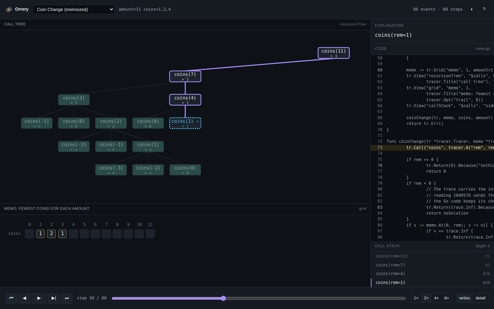
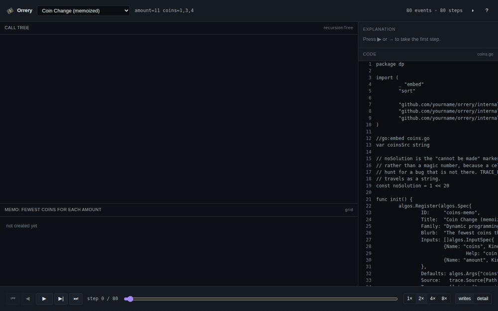
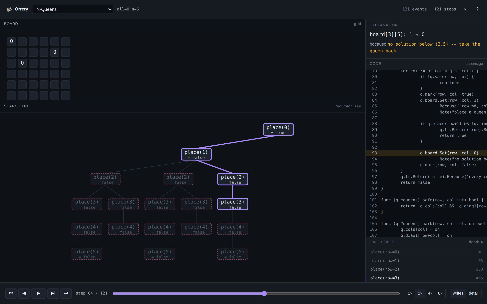
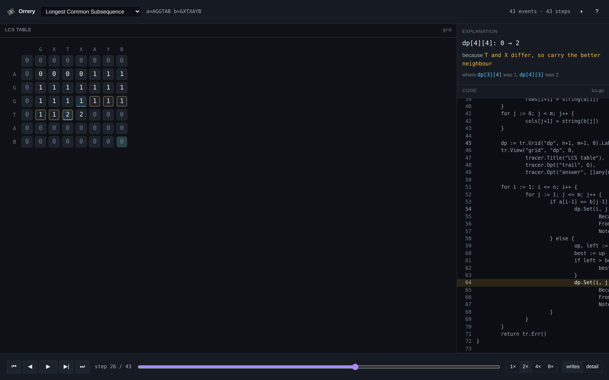

<h1 align="center">Orrery</h1>
<p align="center"><em>A mechanical model of a running algorithm.</em></p>

<p align="center">
  <a href="#run-it">run it</a> ·
  <a href="docs/TRACE_FORMAT.md">trace format</a> ·
  <a href="docs/ARCHITECTURE.md">architecture</a> ·
  <a href="docs/adr/">decisions</a>
</p>



---

Watch an algorithm execute one step at a time — **forwards and backwards** —
with the source code, the data structure, and a plain-English reason for every
value, shown together.



## What makes it different

**Nothing renders itself.** Algorithms emit a **trace**: a flat, ordered list of
tiny reversible events. Renderers consume traces and know nothing about
algorithms. That one rule is why a single visualizer covers sorting, dynamic
programming, recursion and backtracking without becoming five visualizers in a
trench coat — and why adding a fifteenth algorithm is one Go file and zero
frontend changes.

**Backwards is free.** Every write records both its old and its new value, so
stepping back is applying the old one. No snapshots, no re-running. Seeking is
O(distance), not O(target), so the scrubber calls `seek()` on every input event
with no throttling at all.

**The explanations are not generated by a model.** Every write carries the
expression that produced it and the exact cells that were read, with the values
they held *at read time*:

> `dp[6][7]: 0 → 4` · because `1 + dp[5][6]` · where **dp[5][6]** was 3

That is assembled from recorded facts by ~60 lines of template. It is exact,
instant, free, deterministic and works offline.

**The trace is a file, not an implementation detail.** Download any run as
`.orrery.json` and drag it back in later — or hand it to `orrery verify`, or to
anything else that reads the format. It round-trips byte-identically, because
the app hands back the producer's bytes rather than a re-encoding of what it
parsed. A dropped file crosses the same V1–V14 validator the Go side runs, so a
truncated or corrupt trace shows you the validator's findings rather than a
broken screen.

**The flagship:** a memoized DP shown as a recursion tree and a memo table at
once. Hover a cell to find the call that computed it. Hover a `~` memo hit to
watch a dashed arc trace back to where that value came from. Both directions,
no synchronization code — the two panes are pure functions of the same state,
so they cannot drift.

<table>
<tr>
<td width="50%"><br><sub><b>N-Queens.</b> Failed subtrees dim to rose as the search abandons them; the live path stays bright. That is pruning, made visible — from the return value alone, with no algorithm-specific code.</sub></td>
<td width="50%"><br><sub><b>LCS.</b> Amber ring = written this step. Dotted cyan = read to produce it. The faded trail behind shows the fill order — row-major here, scattered for a memoized solve.</sub></td>
</tr>
</table>

## Architecture in 200 words

```
  ALGORITHMS  ──emit──▶  TRACE (JSON)  ──read──▶  PLAYER ──▶ RENDERERS
   Go built-ins           init/set/call/ret       forward/    linear, grid,
   user Go   (Stage B)    + provenance            backward    tree, call stack,
   user C++  (Stage C)    + source lines          /seek       recursion tree
```

Two invariants carry the whole design.

**I1 — local invertibility.** Every event can be undone using only itself. That
buys instant seeking, free rewind, zero snapshot memory, and a player provable
with two property tests.

**I2 — consumer purity.** Renderers never import from algorithms. N algorithms
and M views cost N + M work instead of N × M.

Because a trace is complete before the first frame is drawn, **layout is a batch
problem**: lay out the union of everything that will ever exist, render the
subset that exists now. Recursion trees fill in without a single node ever
moving — by construction, not by damping.

The format is versioned, validated by a checker that runs on every load, and
covered by a **conformance suite** that diffs the Go replayer against the
JavaScript player step by step across every committed fixture.

## Run it

```bash
git clone https://github.com/sanu1001/orrery && cd orrery

make traces                  # generate the built-in traces + catalogue
cd web && npm ci && npm run dev
```

No server required: the fourteen built-in algorithms ship as static JSON next to
the bundle, so the app works with the API off, on a plane, or while a free-tier
container is cold-starting.

### The CLI

```bash
go run ./cmd/orrery ls                          # the catalogue
go run ./cmd/orrery trace lcs --a=AGGTAB --b=GXTXAYB -o /tmp/lcs.json
go run ./cmd/orrery verify /tmp/lcs.json        # V1..V14
go run ./cmd/orrery play   /tmp/lcs.json        # step through it in a terminal
go run ./cmd/orrery bench  nqueens --max 7      # events/steps vs input size
```

`orrery play` exists to prove the point: a completely different consumer of the
same trace, sharing no rendering code with the browser. If a format change
breaks one and not the other, the format is underspecified.

### Tests

```bash
make check     # vet + go test -race + conformance + JS tests
make fuzz      # 60s on the trace decoder; it must never panic
```

| Suite | What it proves |
|---|---|
| `TestRoundTrip` | forward then backward returns to a byte-identical state (I1) |
| `TestSeekEquivalence` | seeking from arbitrary positions equals stepping |
| `TestGroupsRewindInReverse` | a grouped swap is one step and rewinds cleanly |
| `TestCanonMatchesJS` | Go and JS format every number identically |
| `conformance.sh` | 651 step hashes match across 14 traces, in two languages |
| `tidytree.test.mjs` | the tidy-tree layout is symmetric, stable, and stack-safe |
| `tree.test.mjs` | a cyclic or multi-parent tree renders instead of hanging |

## Trace format, in one example

```jsonc
{"t":"init","s":"dp","kind":"grid","dims":[7,8],"fill":0}
{"t":"set","s":"dp","at":[2,1],"from":0,"to":1,
 "expr":"1 + dp[1][0]",
 "deps":[{"s":"dp","at":[1,0],"v":0}],
 "ln":28,"note":"G matches G, so extend the diagonal"}
```

Four event types, one address form, provenance on every write.
[Full spec →](docs/TRACE_FORMAT.md)

## Status

| | |
|---|---|
| **Stage A** | shipped — Go engine, 14 algorithms, 5 renderer families, CLI, conformance suite |
| **Stage B** | designed — paste Go → `go/ast` instrumentation → WASM → runs in *your* browser, never on the server |
| **Stage C** | designed, and deliberately not built — the doc explains what libclang and Emscripten would actually cost |

Built solo. The interesting problems were the format, the reversibility
invariant, deterministic layout over an unknown-but-complete future, and
instrumenting untrusted source without ever executing it server-side.

## License

MIT
